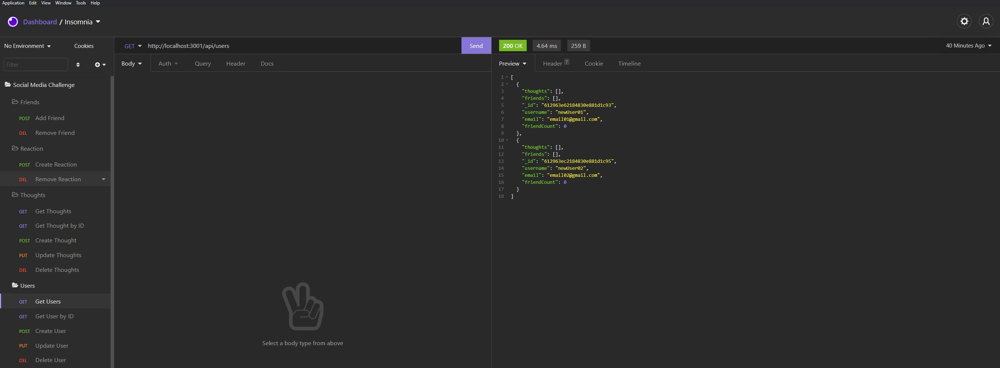

  # NoSQL Challenge: Social Network API

  ## **Description**
  This is API for a social network web application where users can share their thoughts, react to friends' thoughts, and create a friend list. It uses Express.js for routing, a MongoDB database, and Mongoose ODM.

  ## **Images**
  
  
  ## **Table of Contents**
  
  * [Installation](#dependencies)
  * [Usage](#usage)
  * [License](#license)
  * [Features](#features)
  * [Languages](#languages)
  * [Technology](#technology)
  * [Tests](#tests)
  * [Contribute](#contribute)
  
  ## **Installation**
  npm i, npm install mongoose

  ## **Usage**
  After installing dependencies, use Insomnia to run routes. Refer to the video included in this README to see what that looks like.

  ## **License**
  
   
  https://opensource.org/licenses/MIT
   

  ## **Features**
  Video for base assignment:

  https://drive.google.com/file/d/1pPc2XbKu_EqfC8b2GWxO6kTfznjShEYm/view

  Video for Bonus (removing user removes the thought data as well): 

  https://drive.google.com/file/d/1tZPjojsaeu9NOKcsyH4qQi_YpZImJueO/view

  ## **Languages**
  JavaScript
  
  MongoDB

  Mongoose
  

  ## **Technology**
  https://www.npmjs.com/package/mongoose

  https://mongoosejs.com/

  https://www.mongodb.com/

  ## **Tests**
  No tests have been coded for application

  ## **Contribute**
  Find me on [GitHub](https://www.github.com/mattbisbee)
   
  Send me an [Email](mailto:aldhelm7@gmail.com)
   
  [Contributor Covenant](https://www.contributor-covenant.org/)
